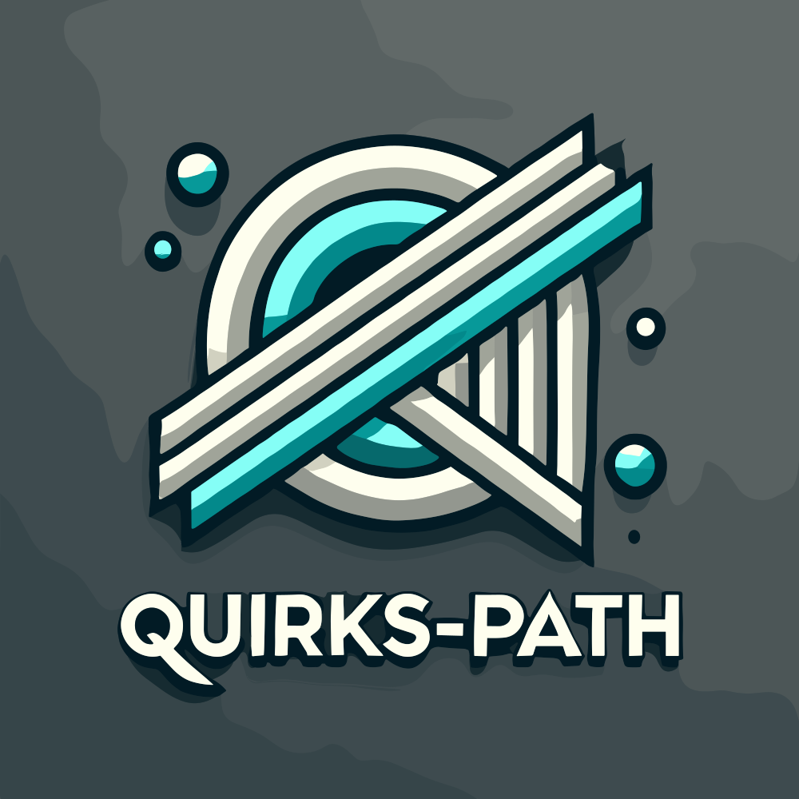

<h1 align="center">
  
  <br />
  <div align="center"><a href="https://crates.io/crates/quirks_paths"></a> <a href="https://docs.rs/quirks_paths"></a></div>
</h1>

<p align="center">A Rust path library with quirks that is as platform-agnostic as possible.</p>

## Quick Start

### Install

```shell
cargo install quirks-path
```

### Import

```rust
use quirks_path::{ Path, PathBuf };
```

## FAQ

### 1. Why create a quirky path library?

Forked from std::path, the library provides as much cross-platform path manipulation capability as possible. 

One major use case is serving as an intermediary server: receiving path data from clients, performing path operations, and then forwarding it to a third party service (with the third party's system platform determined solely by the client).

### 2. Support List

- *nix Paths (without `/`): `/bin/sh`
- Windows Verbatim: `\\?\cat_pics`
- Windows Verbatim UNC: `\\?\UNC\server\share`
- Windows Verbatim Disk: `\\?\C:`
- Windows DeviceNS: `\\.\COM42`
- Windows UNC: `\\server\share`
- Windows Disk: `C:`

### 3. Quirks

- Think any of / or \ be a seperator or special mark

- Prefer think paths that not have verbatim prefix and start with / be *nix-like root paths

- Prefer think paths start with drive as windows drive paths, and if not contains / sep then default use \ sep

- When call absolute method it will not trim components trailing space and dots (windows style) and not remove parent ..

- Prefer think paths that not have verbatim prefix and start with \\ be *windows-like root paths

- Lack of extra information, think COM1 as relative path
